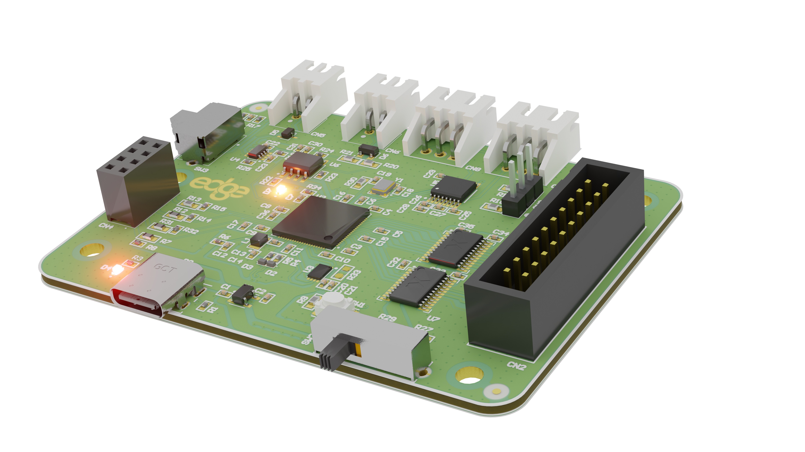

# Multi-Signal-Analyzer – Hardware

Open-source hardware for a low-cost, portable data acquisition (DAQ) device based on the **Raspberry Pi RP2350B** microcontroller. The board combines a 12-channel logic analyzer, 3 analog inputs and passive CAN, RS-485 and RS-232 interfaces, and works with the open-source **sigrok / PulseView** software.

This repository contains the **hardware design files** (Altium Designer project, schematic, PCB and fabrication files).
The firmware lives in a separate repository: **[Multi-Signal-Analyzer](https://github.com/nivuciis/Multi-Signal-Analyzer)**.



---

## Contents

- [Features](#features)
- [Repository structure](#repository-structure)
- [Hardware overview](#hardware-overview)
- [Getting started](#getting-started)
- [Fabrication](#fabrication)
- [Bill of materials](#bill-of-materials)
- [Revisions and known issues](#revisions-and-known-issues)
- [Citation](#citation)
- [Acknowledgments](#acknowledgments)
- [License](#license)

---

## Features

| | |
|---|---|
| **Microcontroller** | RP2350B (dual Arm Cortex-M33, PIO, DMA) |
| **Digital inputs** | 12 channels, selectable logic level: 1.65 V, 2.5 V, 3.3 V or 5.0 V |
| **Analog inputs** | 3 channels, 12-bit ADC, input range up to 12 V |
| **Bus interfaces** | CAN, RS-485 and RS-232, receive-only (passive sniffing) |
| **Host connection** | USB 2.0 Full Speed, Type-C, bus powered |
| **Software** | sigrok / PulseView (sigrok-pico protocol) |
| **PCB** | 4 layers, approx. 76 × 82 mm |
| **Approx. cost** | ≈ US$ 35 per unit (components + PCB, batch of 5) |

---

## Repository structure

```
.
├── source/          Altium Designer project (.PrjPcb, .SchDoc, .PcbDoc, libraries)
├── schematic/       Schematic in PDF
├── fabrication/     Gerbers, drill files, BOM and pick-and-place
├── images/          Photos, renders and layer images
├── LICENSE
└── README.md
```

Ready-to-order fabrication files for each revision are also attached to the [Releases](../../releases) page.

---

## Hardware overview

### Power
- Powered entirely from USB VBUS, no external supply required.
- An LDO regulator (TLV75533) provides the main +3.3 V rail.
- The RP2350B core voltage (+1.1 V) is generated by its internal SMPS.
- TVS protection on VBUS and low-capacitance ESD suppressors on the USB data lines.

### Digital inputs
- 12 channels on a 20-pin flat-cable (IDC) header.
- Two 74LVCH8T245 octal transceivers translate the target logic level to 3.3 V. They are wired unidirectionally (connector → MCU).
- The target-side reference (+VREF) is selected with a four-position slide switch: **1.65 V, 2.5 V, 3.3 V or 5.0 V**. No firmware change is needed.

### Analog inputs
- 3 channels connected to the RP2350B internal 12-bit ADC (0 – 3.3 V).
- Each channel has a resistive divider (R1 = 370 kΩ, R2 = 100 kΩ):

  V<sub>ADC</sub> = V<sub>IN</sub> · 100 kΩ / (370 kΩ + 100 kΩ) ≈ 0.2127 · V<sub>IN</sub>

  A 12 V input therefore appears as approx. 2.55 V at the ADC pin.

### Bus interfaces (passive)
All transmit paths are left floating or disabled in hardware, so the board never injects traffic into the monitored bus.

| Bus | Transceiver | Notes |
|---|---|---|
| CAN | TCAN1044A | 5 V bus side, 3.3 V logic side (split supplies) |
| RS-485 | THVD1400 | Pull-down keeps the transceiver in receive mode; pull-up on RX |
| RS-232 | MAX3232 | Only receivers used: TX and RX of a link captured simultaneously |

### PCB
- 4-layer stack-up: L1 signals and components, L2 solid GND plane, L3 power, L4 secondary GND and auxiliary routing.
- Controlled impedance: USB D+/D− at 90 Ω differential; CAN and RS-485 at 120 Ω differential.
- Dedicated analog area over a common ground plane.
- Length-matched QSPI flash routing; 12 MHz crystal with 1 kΩ series damping resistor.

---

## Getting started

> ⚠️ **Before connecting to a target**, set the VREF slide switch to the target's logic level. Do not exceed 12 V on the analog inputs.

1. **Flash the firmware.** Compile the data from [firmware](https://github.com/nivuciis/Multi-Signal-Analyzer). Put the RP2350B in USB bootloader mode (BOOTSEL) and copy the `.uf2` file to the drive that appears.
2. **Install PulseView** from [sigrok.org](https://sigrok.org/wiki/Downloads).
3. **Connect the board** to the computer through the USB-C port.
4. In PulseView, open **Connect to Device**, choose the driver **RaspberryPI PICO (raspberrypi-pico)**, select **Serial Port** and the port of the board (`COMx` on Windows, `/dev/ttyACMx` on Linux), then click **Scan for devices**.
5. Select the channels and sample rate, and start capturing. Use PulseView's protocol decoders (UART, I²C, SPI, CAN, …) to decode the captured signals.

> Note: simultaneous analog and digital capture is limited at high sample rates because of the RP2350 ADC throughput.

---

## Fabrication

The P1 boards were manufactured with the following parameters:

| Parameter | Value |
|---|---|
| Layers | 4 |
| Finished thickness | 1.56 mm |
| Core | FR-4, 1.03 mm |
| Prepreg | 2 × 0.20 mm |
| Copper thickness | 0.02 mm (L1/L4), 0.04 mm (L2/L3) |
| Dimensions | approx. 76 × 82 mm |
| Impedance control | Yes (90 Ω and 120 Ω differential pairs) |

To order boards, upload `fabrication/gerbers_P1.zip` to your PCB manufacturer (the prototypes were made at JLCPCB) and select the 4-layer impedance-controlled stack-up above. For SMT assembly, also provide the BOM and the pick-and-place file from `fabrication/`.

---

## Bill of materials

Summary per unit (Digi-Key prices at the time of design). The full BOM is in `fabrication/`.

| Category | Key part(s) | USD |
|---|---|---|
| Microcontroller | RP2350B | 1.77 |
| Flash memory (32 Mbit) | W25Q32RVXHJQ | 0.50 |
| CAN transceiver | TCAN1044AVDDFRQ1 | 0.88 |
| RS-232 transceiver | MAX3232CPWR | 2.06 |
| RS-485 transceiver | THVD1400DR | 0.81 |
| Level shifters (×2) | 74LVCH8T245PW | 1.88 |
| LDO regulator | TLV75533PDBVR | 0.37 |
| Crystal 12 MHz | ABM8-272-T3 | 0.54 |
| Inductor 3.3 µH | AOTA-B201610S3R3 | 0.22 |
| TVS diodes and ESD | STN161050, TPD1E0B04, … | 3.40 |
| Capacitors | X5R/X7R/C0G 0402 | 2.01 |
| Resistors | 0402/0603 | 3.84 |
| Connectors | USB-C, IDC, JST, headers | 2.89 |
| Switches and LEDs | Tactile, slide, SMD LED | 1.93 |
| **Components total** | | **22.60** |
| PCB (4 layers, batch of 5) | | ≈ 12.00 |
| **Unit total** | | **≈ 35** |

---

## Revisions and known issues

| Revision | Status | Notes |
|---|---|---|
| **P1** | First prototype | Finished on Jan 2026 |

**Known issues in P1**
- Crosstalk of approx. 5% observed between adjacent analog channels (A3 → A2). This was caused by the excess on impedance from the voltage divider and can be solved by lowering the resistors values by 10 or smaller but make sure the voltage divider remains within the operational range of the ADC.
 If the input has higher current passing through do not lower the divider values.


**Planned work**
- Benchmark the maximum deterministic sampling rate (target: 50 MHz).
- Characterize analog linearity and SNR over the full input range.
- Validate continuous multi-protocol decoding under heavy bus load.


---

## Acknowledgments

This project was supported by the Ministry of Science, Technology and Innovation (MCTI), with resources provided under Law No. 8,248/1991, within the scope of the PPI ICT Residency 31, coordinated by Softex.

We also thank the open-source community, especially the developers and maintainers of the sigrok project.

---

## License

The hardware design files in this repository (schematics, PCB layout, Gerbers and BOM) are licensed under the **CERN Open Hardware Licence Version 2 – Permissive (CERN-OHL-P-2.0)**. See [LICENSE](LICENSE).

Documentation, photos and renders are licensed under [CC BY 4.0](https://creativecommons.org/licenses/by/4.0/).

Copyright © 2026 Vinicius R. M. de Carvalho, João M. N. Dias, Ícaro B. Q. de Araújo, Rodrigo J. S. Peixoto – Universidade Federal de Alagoas (UFAL).

Source location: https://github.com/nivuciis/Multi-Signal-Analyzer-Hardware

---

## Contact

Universidade Federal de Alagoas (UFAL), Maceió, AL, Brazil
vrmc@ic.ufal.br · jmnd@ic.ufal.br · icaro@ic.ufal.br · rjsp@ic.ufal.br

 
## Contributing
 
Feel free to contribute to this project in whatever way works best for you! Every contribution is welcome, for example:
 
- Reporting bugs, design issues or questions in the [Issues](../../issues) page
- Suggesting improvements for the next hardware revision
- Submitting pull requests with fixes or new features
- Building your own board and sharing your results, photos or measurements
If you use this board in a class, lab or project, we would love to hear about it.
 